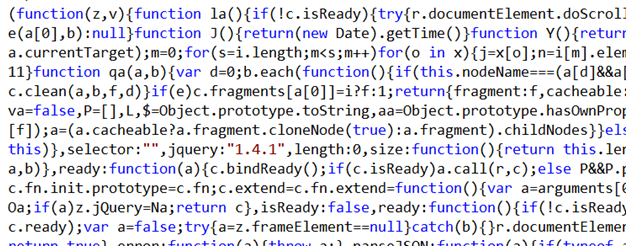
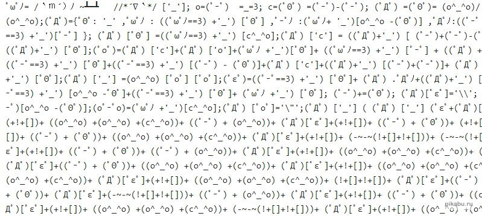
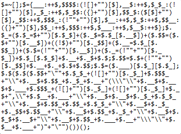
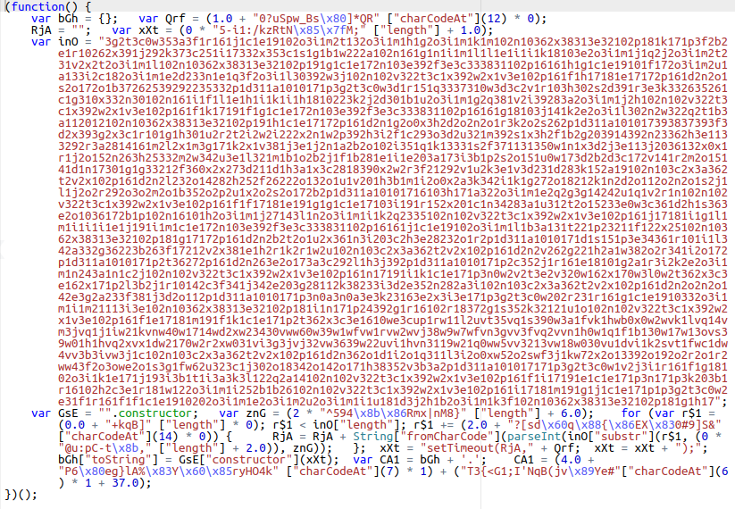

# Терминология процесса производства кода

## Сборка

Процесс преобразования исходного кода программы в готовый продукт. Может содержать различные преобразования, список которых приведён ниже.

Примеры сборщиков: [Webpack](https://webpack.js.org/ "Webpack"), [gulp](https://gulpjs.com/ "gulp"), [grunt](https://gruntjs.com/ "grunt"), [Parcel](https://parceljs.org/ "Parcel"), [esbuild](https://esbuild.github.io/), [rollup.js](https://rollupjs.org/guide/en/).

## Транспиляция

+ Преобразование программы с одного языка программирования на другой, находящийся примерно на том же уровне абстракции (TypeScript → JavaScript, JSX → JavaScript). Пример: [TypeScript](https://www.typescriptlang.org/ "TypeScript").  
Главное отличие от компилятора в том, что компилятор преобразует код с более высокоуровневого языка на язык более низкого уровня (ассемблер, машинный код, MSIL, байт-код).

+ Преобразование кода из одной версии языка в другую версию того же языка, причём преобразование может быть в обе стороны: старая версия → новая версия или новая версия → старая версия (ES6+ → ES5 или ES3). Пример: [Babel](https://babeljs.io/ "Babel").

## Bundling

Объединение нескольких файлов в один (bundle). Используется для уменьшения количества запросов с клиента на сервер, применяется к CSS и JavaScript. Обычно является функцией сборщика.

## Tree shaking

Tree shaking – оптимизация итоговых пакетов кода путём удаления неиспользуемых функций и модулей. Обычно является функцией сборщика.

## Минификация

Уменьшение размера исходного кода путём удаления ненужных символов (и других преобразований, например, вычисления выражений) без изменения его функциональности. Применяется к JavaScript, CSS. Производится с помощью сборщиков или отдельных утилит.

Так же используется термин `минимизация`.

Минифицированным версиям файлов часто дают расширение `*.min.js`.

Пример минифицированного кода – jquery.min.js:

Примеры минификаторов: [Google Closure Compiler](https://developers.google.com/closure/compiler/), [UglifyJS](https://github.com/mishoo/UglifyJS).

## Обфускация

Обфускация или запутывание кода — приведение исходного кода программы к виду, сохраняющему её функциональность, но затрудняющему анализ, понимание алгоритмов работы и модификацию.

Обфускация на уровне исходного кода (например, для JavaScript) включает в себя замену имён и форматирование текста программы.

Примеры обфусцированного кода:

