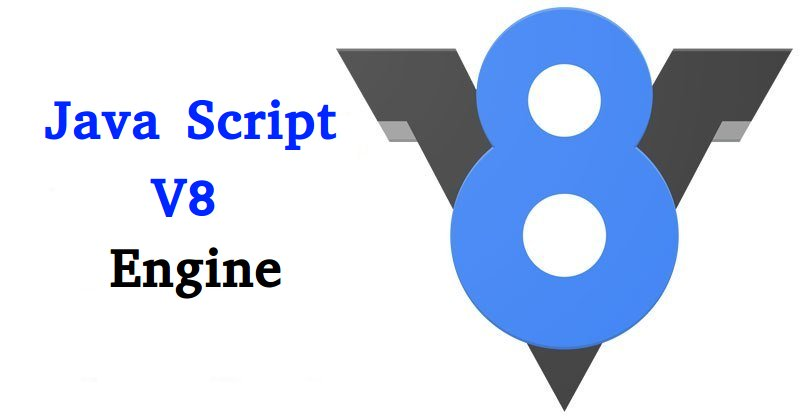
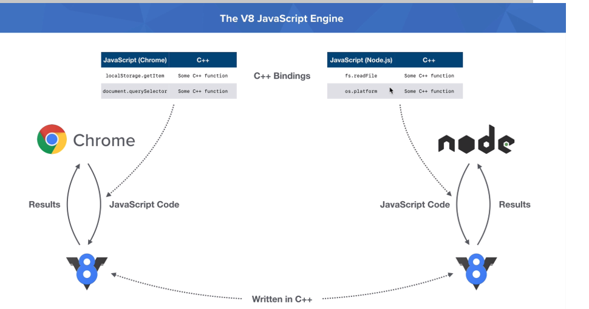

# Node.js

Исполнением JavaScript в браузерах занимаются их специальные подсистемы, называемые "движком JavaScript". В каждом браузере такой движок свой:

* IE: _Chackra_
* Safari: _Nitro_
* Firefox: _SpiderMonkey_
* Chrome: _V8_

и т.д.

В 2009 году Райан Даль создал платформу _Node.js_ (или просто _Node_), которая использует движок V8 для испольнения JavaScript на сервере.

Node.js широко используется в современной фронтенд-разработке, т.к. обеспечивает работу инструментария по производству кода: менеджера пакетов, сборщика модулей и т.д.

В 2018 году Райан Даль предложил алтернативу _Node.js_ – платформу _Deno_.

