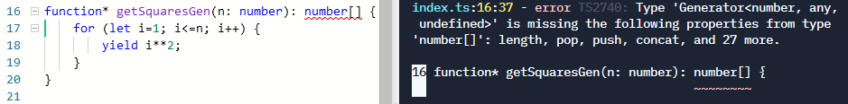
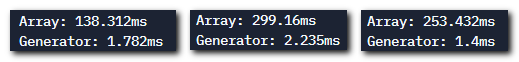

# Функции-генераторы

## Синтаксис функций-генераторов

Рассмотрим функцию, возвращающую квадраты первых N натуральных чисел:

```javascript
function getSquaresArr(n) {
    let result = [];
    for (let i = 1; i <= n; i++) {
        result.push(i**2);
    }
    return result;
}

const squaresArr = getSquaresArr(9);
for (const square of squaresArr) {
    console.log(square); // 1, 4, 9, ..., 64, 81
}
```

Подобные задачи – перебрать в цикле некоторый набор данных (последовательность) – можно решить другим способом, с помощью т.н. генераторов:

```javascript
function* getSquaresGen(n) {
    for (let i = 1; i <= n; i++) {
        yield i**2;
    }
}

const squaresGen = getSquaresGen(9);
for (const square of squaresGen) {
    console.log(square); // 1, 4, 9, ..., 64, 81
}
```

Синтаксических отличий функций-генераторов от обычных функций два:
* после слова `function` должна быть звёздочка
* данные из функции в вызывающий код возвращаются с помощью конструкции `yield`, а не `return`.

## Как работают функции-генераторы

Для примера возьмём очень простую функцию-генератор:

```javascript
function* genDemo() {
    yield 1;
    yield 2;
    yield 3;
}
```

В отличие от обычной функции, в которой код всегда выполняется полностью – от начала и до `return`, функция-генератор при первом обращении фвернёт значение _**1**_ и остановится. При втором – вернёт значение _**2**_ и тоже остановится, и т.д. Т.е. при каждом вызове функции-генератора запоминается её текущее состояние.

## Что на самом деле возвращают функции-генераторы

Если мы работаем в TypeScript и нам необходимо задать типы параметров и возвращаемого значения для наших функций, то для первой всё очевидно:

```TypeScript
function getSquaresArr(n: number): number[] {
```

Если попробовать сделать то же самое для функции-генератора, то при компиляции получим ошибку:

```typescript
function* getSquaresGen(n: number): number[] {
```



Дело в том, что функция-генератор возвращает специальный объект-итератор:
```javascript
function* getSquaresGen(n: number): IterableIterator<number> {
```

Именно итераторы позволяют проходить по набору данных с помощью цикла `for/of`.

Массив тоже можно использовать совместно с этим циклом, т.к. у него есть свой встроенный итератор:

```typescript
console.log(squaresArr[Symbol.iterator]); // [Function: values]
```

```typescript
const squaresArrIter: IterableIterator<number> = squaresArr[Symbol.iterator]();
for (const square of squaresArrIter) {
    console.log(square);
}
```

## В каких случаях генераторы могут быть полезны?

1. В отличие от обычных функции, генераторы могут возвращать бесконечную последовательность данных.

2. Генераторы не хранят всю последовательность данных, а возвращают их по одному, поэтому они значительно экономичнее по памяти, и, как следствие, по быстродействию.

Для примера вызовем 10 тыс. раз генерацию квадратов 999 первых натуральных чисел.

```javascript
console.time('Array');
for (let i = 0; i < 10_000; i++) {
    const z = getSquaresArr(999);
}
console.timeEnd('Array');

console.time('Generator');
for (let i = 0; i < 10_000; i++) {
    const z = getSquaresGen(999);
}
console.timeEnd('Generator');
```

Три замера:



## Преобразование последовательности генератора в массив

Чтобы извлечь все значения, генерируемые функцией-генератором (о, тавтология 😊), можно воспользоваться конструкцией `spread`:

```js
const arr = [...getSquaresGen(9)];
console.log(arr.length); // 9
console.log(arr); // [1,4,9,16,25,36,49,64,81]
```
