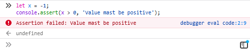

# Объект console

Приём: при выводе с помощью `console.log` "заворачивать" выводимое значение в объект – тогда значение выведется вместе с именем.

```javascript
let name = 'Mark Knopfler';
console.log(name); // Mark Knopfler
console.log({ name }); // { name: 'Mark Knopfler' }
```

Можно так: `console.log({ x , y });` или так: `console.log({ x }, { y });`.

---
`console.clear()` – очистка консоли

`console.error(текст)` – выводит сообщение красным цветом с красной иконкой  
`console.warn(текст)` – выводит сообщение жёлтым цветом с жёлтой иконкой  
`console.info(текст)` – выводит сообщение с иконкой информации


__Примечание:__ `warn` и `error` кроме отображения значения ещё позволяют посмотреть стек вызовов.

Есть ещё `console.debug(текст)` – как работает, не очень понятно: в FF так же, как и `console.log`, в Google Chrome вообще ничего не вывелось. Но участвует в фильтрации сообщений (см. ниже).

Сообщения в консоли можно фильтровать по уровню (info, warn, debug, ...). На скриншоте FF rus и Google Chrom eng:


`dir(object)` – визуализирует объект в консоли; элементы DOM `console.log` отображает как HTML (разметка), а `console.dir` как JavaScript-объекты.   
`dirxml(object)` – визуализирует объект в консоли как XML; отличий `dirxml` от `console.log` не обнаружено.  

----

`console.trace()` – выводит стек вызова  
`console.memory` – показывает состояние памяти (внимание: свойство, а не метод)


----

`console.count()` – выводит значение счётчика (начиная с 1), при каждом выводе значение инкрементируется


`console.count('counter_name')` – можно использовать несколько независимых именованных счётчиков


----

`console.group('group name')` – начинает группировку, `console.groupCollapsed('group name')` – то же, но группа изначально свёрнута

`console.groupEnd()` – заканчивает группировку; группы могут быть вложенными

Пример:
```javascript
console.group('User Details');
console.log('name: John Doe');
console.log('job: Software Developer');
// Вложенная группа
console.group('Address');
console.log('Street: 123 Townsend Street');
console.log('City: San Francisco');
console.log('State: CA');
console.groupEnd();
console.groupEnd();
```
Результат:


----

`console.table('object')` – выводит объект (в т.ч. массив) в табличном виде


----
`console.time('timer name')` – запускает именованный таймер; может быть запущено сразу несколько разных  
`console.timeEnd('timer name')` – останавливает таймер и выводит длительность работы таймера в милисекундах


----

`assert(condition, 'message')` – если `condition === false`, выводит в консоль сообщение  


----

## TODO:
- `debugger` – точка останова (breakpoint)  
- `debug('message')` – выводит сообщение в консоль; если передать объект, он преобразуется в строку (примечание: вроде метод не нативный, надо подключать библиотеку)  
- `select(element)` – выбирает элемент в DOM  
- `profile('reportName')`, `profileEnd()` – ??? (что-то связанное с оптимизацией)
