# Console API

## `$0` – `$4`

В DevTools браузеров можно выбрать для инспектирования какой-либо элемент на странице:

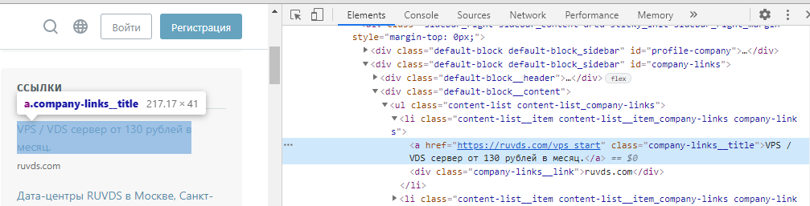

В командной строке консоли DevTools можно обращаться к этому элементу с помощью записи `$0`:

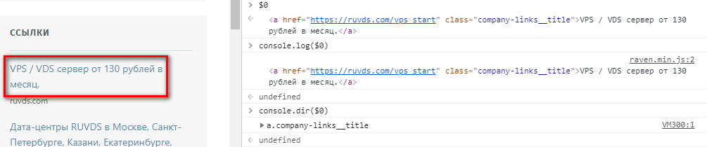

Примечание: `console.log` выводит элемент как HTML-разметку, `console.dir` – в виде JavaScript-объекта.

Доступны выражения `$0`-`$4`, где `$0` всегда – самый последний из инспектируемых элементов:

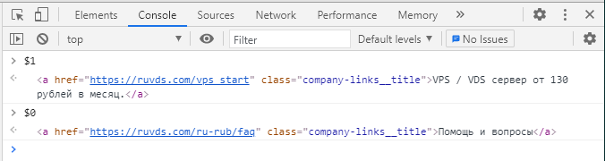

----

## `$_`

`$_` – обращение к последнему результату вычислений

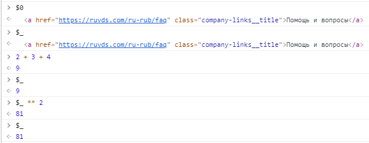

----

## `$(селектор)`, `$$(селектор)`

`$(селектор)` == `document.querySelector(селектор)`, т.е. позволяет выбрать элемент по селектору (тегу, классу, id, ...)

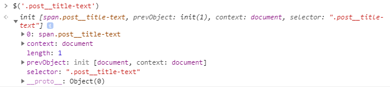

`$$(селектор)` == `document.querySelectorAll(селектор)`, т.е. позволяет выбрать элементы по селектору (тегу, классу, id, ...), выбранные элементы помещаются в массив

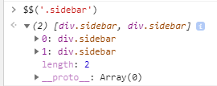

----

## `getEventListeners`

Команда `getEventListeners($(селектор))` (вместо `$(селектор)` могут использоваться `$0` – `$4`) позволяет просмотреть обработчики событий, привязанные к элементу:

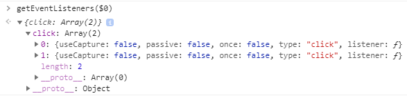

Для того, чтобы получить код обработчика, нужно использовать конструкцию `getEventListeners($(селектор)).<имя_события>[0].listener`, например:

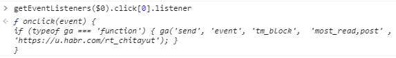

----

## monitorEvents

Команда `monitorEvents($(селектор))` включает мониторинг событий для указанного элемента. При наступлении какого-либо события в консоль выводится информация об этом событии.  
Внимание! Не работает в FireFox.

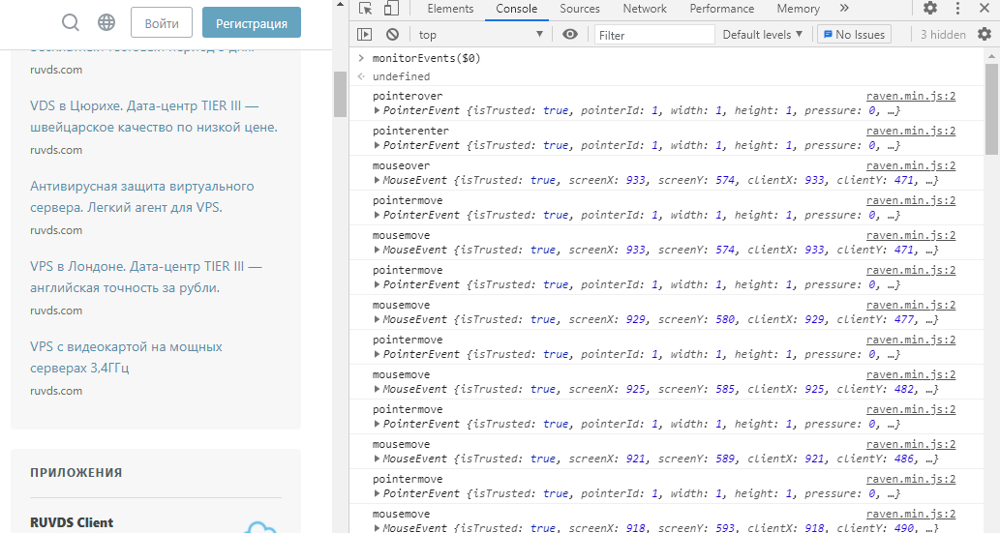

С помощью команды `monitorEvents($(селектор), событие)` можно включить отслеживание определённого события.

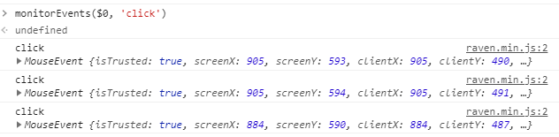

Команда `monitorEvents($(селектор),['eventName1','eventName2',….])` позволяет наблюдать за несколькими событиями, например: `monitorEvents($('#firstName'), ['click', 'focus'])`.

Команда `unmonitorEvents($(селектор))` отключает мониторинг событий для указанного элемента.

----

## `inspect`

Команда `inspect(селектор)` позволяет перейти к указанному элементу во вкладке **Elements** (**Инспектор**)

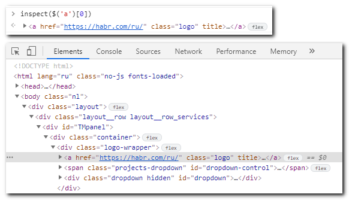

----

## `clear()`

`clear()` – очистка консоли и памяти (`console.clear()` память не очищает)