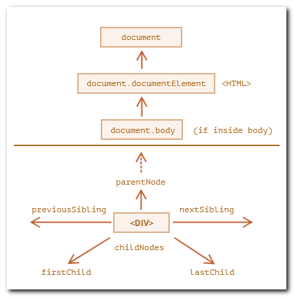
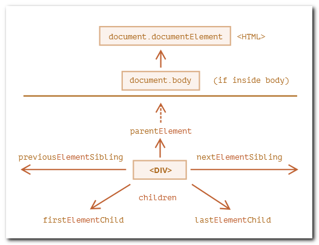

## Навигация по DOM

#### Навигация по узлам DOM (nodes)

- `<html> = document.documentElement`
- `<body> = document.body`
- `<head> = document.head`

Примечание 1: `document.body` равен `null`, если скрипт находится в `head` (`body` ещё не создан).

Примечание 2: `childNodes` – это не массив, а _коллекция_.  
Можно обращаться по индексу и обходить с помощью `for..of`, но не работают методы массивов. Можно преобразовать в массив: `Array.from(document.body.childNodes)`.

DOM-коллекции только для чтения.  
DOM-коллекции – "живые".

#### Навигация по элементам (elements)

#### Навигация в таблицах

У следующих элементов таблицы есть дополнительные навигационные свойства:
* `<table>`:
  - `table.rows` – коллекция строк `<tr>` таблицы.
  - `table.caption`/`tHead`/`tFoot` – ссылки на элементы таблицы `<caption>`, `<thead>`, `<tfoot>`.
  - `table.tBodies` – коллекция элементов таблицы <tbody> (по спецификации их может быть больше одного).
* `<thead>`, `<tfoot>`, `<tbody>`:
  - `tbody.rows` – коллекция строк `<tr>` секции.
* `<tr>`:
  - `tr.cells` – коллекция `<td>` и `<th>` ячеек, находящихся внутри строки `<tr>`.
  - `tr.sectionRowIndex` – номер строки `<tr>` в текущей секции `<thead>`/`<tbody>`/`<tfoot>`.
  - `tr.rowIndex` – номер строки `<tr>` в таблице (включая все строки таблицы).
* `<td>` и `<th>`:
  - `td.cellIndex` – номер ячейки в строке `<tr>`